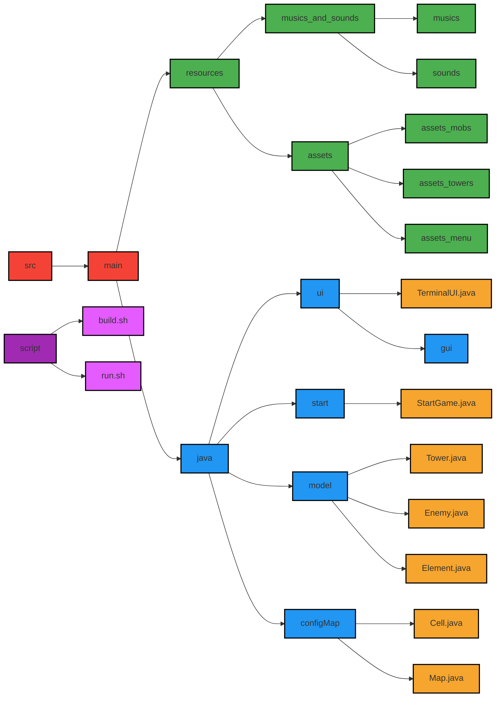

```mermaid
graph LR

%% Red style for root
	style src fill:#f44336,stroke:#000,stroke-width:2px,rounded
	style main fill:#f44336,stroke:#000,stroke-width:2px,rounded

%% Green style for assets repositories
	style resources fill:#4CAF50,stroke:#000,stroke-width:2px,rounded
	style musics_and_sounds fill:#4CAF50,stroke:#000,stroke-width:2px,rounded
	style musics fill:#4CAF50,stroke:#000,stroke-width:2px,rounded
	style sounds fill:#4CAF50,stroke:#000,stroke-width:2px,rounded
	style assets fill:#4CAF50,stroke:#000,stroke-width:2px,rounded
	style assets_towers fill:#4CAF50,stroke:#000,stroke-width:2px,rounded
	style assets_mobs fill:#4CAF50,stroke:#000,stroke-width:2px,rounded
	style assets_menu fill:#4CAF50,stroke:#000,stroke-width:2px,rounded

%% Blue style for java repositories
	style java fill:#2196F3,stroke:#000,stroke-width:2px,rounded	
	style model fill:#2196F3,stroke:#000,stroke-width:2px,rounded	
	style start fill:#2196F3,stroke:#000,stroke-width:2px,rounded	
	style ui fill:#2196F3,stroke:#000,stroke-width:2px,rounded	
	style gui fill:#2196F3,stroke:#000,stroke-width:2px,rounded	
	style configMap fill:#2196F3,stroke:#000,stroke-width:2px,rounded	

%% Orange style for java files
	style TerminalUI.java fill:#f6a52e,stroke:#000,stroke-width:2px,rounded
	style StartGame.java fill:#f6a52e,stroke:#000,stroke-width:2px,rounded
	style Tower.java fill:#f6a52e,stroke:#000,stroke-width:2px,rounded
	style Enemy.java fill:#f6a52e,stroke:#000,stroke-width:2px,rounded
	style Element.java fill:#f6a52e,stroke:#000,stroke-width:2px,rounded
	style Cell.java fill:#f6a52e,stroke:#000,stroke-width:2px,rounded
	style Map.java fill:#f6a52e,stroke:#000,stroke-width:2px,rounded
%% Violet style for build/launch 
    style script fill:#a02ab2,stroke:#000,stroke-width:2px,rounded
    style build.sh fill:#e45bff,stroke:#000,stroke-width:2px,rounded
    style run.sh fill:#e45bff,stroke:#000,stroke-width:2px,rounded


    
%% -----------------------------------------------------------------------------
	
%% Base of tree
src --> main
	main --> resources
	main --> java

%% Script
script --> build.sh
script --> run.sh

	%% Ressource's tree
	resources --> musics_and_sounds
	resources --> assets
	musics_and_sounds --> musics
	musics_and_sounds --> sounds
	assets --> assets_mobs
	assets --> assets_towers
	assets --> assets_menu

	%% Java's tree
	java --> ui
	java --> start
	start --> StartGame.java

	java --> model
	java --> configMap
	ui --> TerminalUI.java
	ui --> gui

	model --> Tower.java
	model --> Enemy.java
	model --> Element.java

	configMap --> Cell.java
	configMap --> Map.java
```